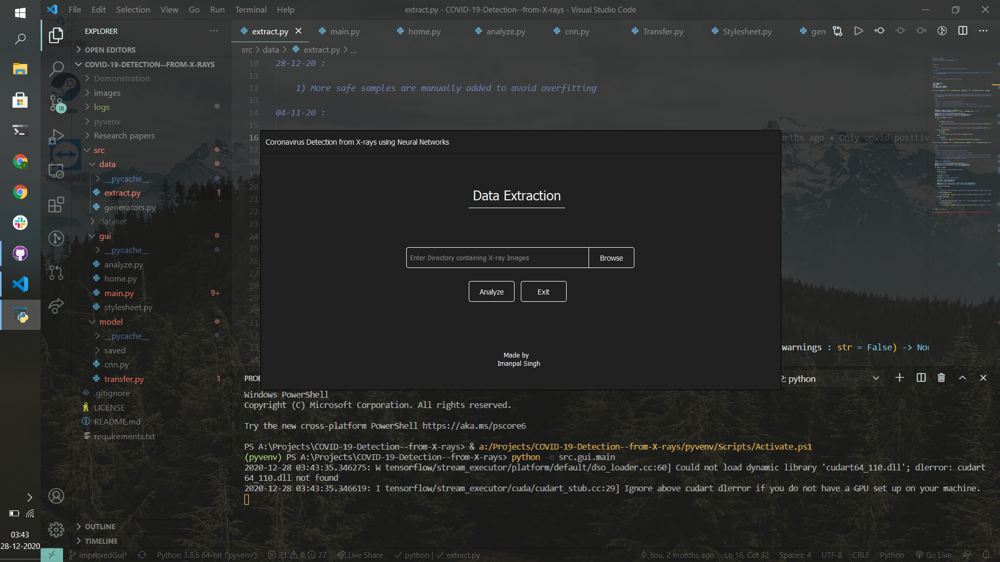

# COVID-19 Detection from X-rays
## Introduction
Prediction of Covid-19 positive from X-rays. The images  in the Dataset used are  Denoised with [Convolutional Variational AutoEncoder](https://www.tensorflow.org/tutorials/generative/cvae) (hyperparameterized for Covid-19 Dataset) and a Convolutional Neural Network is used for classification with softmax entropy loss.

### Can X-rays be used for Covid-19 Detection?

This work supports it:
https://pubs.rsna.org/doi/10.1148/radiol.2020200432 and https://pubs.rsna.org/doi/10.1148/radiol.2020200642

And this recommends not using it: https://www.acr.org/Advocacy-and-Economics/ACR-Position-Statements/Recommendations-for-Chest-Radiography-and-CT-for-Suspected-COVID19-Infection

Note : This model doesn't claim any diagnostic performance. This is merely an implementation of neural networks for classification.

Read about the problems in deep learning for COVID-19 Detection in  https://arxiv.org/abs/2004.12823 and https://arxiv.org/abs/2004.05405


## Dataset

The dataset used is publicly available at https://github.com/ieee8023/covid-chestxray-dataset. The dataset can be used for research purposes and belongs to the owner of the repository.

The dataset contains X-rays of various diseases, but the X-rays of only Covid-19 Positive are extracted. The healthy X-rays are extracted from https://www.kaggle.com/paultimothymooney/chest-xray-pneumonia. The dataset ratio of positive:healthy were kept to 50%-50%


Note : Read the earlier analysis done with this dataset in the above linked papers.


## Results

The model achieves `0.968` accuracy, `0.9877` AUC scores on train set and `0.901` accuruacy , `0.92441` AUC scores on test set after `20` epochs of training on Google Colab with GPU for ~30 mins.

The model however performs really poorly on complex structures such as in this [research](https://www.nature.com/articles/s41598-019-42557-4). A Sequential single input and single output architecture with increasing filters outperforms any other complex structures.

## Executing

### Extracting data

```python
from src.data.extract import class_wise, train_test_wise

if __name__ == "__main__":

    class_wise('src/dataset/input', 'src/dataset/classwise')
    train_test_wise("src/dataset/classwise/", "src/dataset/traintest/" , 0.5, True)

```

### Training model

```
python -m src.model.cnn
```

### Using GUI

```
python -m src.gui.main
```


